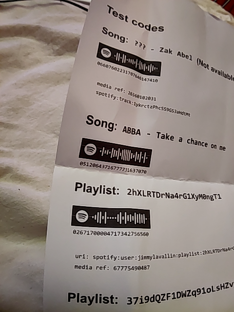
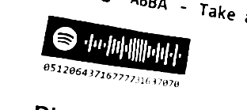

# Guessify Scanner

We tried using off the shelf barcode scanners. However, no dice.
We got [`barcode-detector`](https://github.com/Sec-ant/barcode-detector/) to work, but, this one doesn't support custom scanners.
We tried [`@ericblade/quagga2`](https://github.com/ericblade/quagga2), but, this required too much setup outside what we already had.
Thus, we decided to roll our own scanner.

We found [this article](https://boonepeter.github.io/posts/spotify-codes-part-2/) explaining how the Spotify codes work.
Since we we're planning to use the article and [its repo](https://github.com/boonepeter/boonepeter.github.io-code/tree/main/spotify-codes-part-2) to build our own scanner for `quagga`, we can use it for our own crude scanner too.

## Finding the code

Because the Spotify codes rely on height of bars, it's not a simple vertical pixel sampler.  
Just as an illustration, we've overlayed a code with itself offset to all 4 axes, and, rotated a bit both ways.  
Even without taking perspective into account, this already looks like this:  
  

There's simply no way of telling where the bars start or end.

## Analyzing the image

We start with using the default canvas filters to get a high-contrast grayscale image.  

> When we take the raw camera input:
>   
> This is what the viewfinder sees:
>   

## Step 1, finding the circle

As stated in [Peter Boone's blog](https://boonepeter.github.io/posts/2020-11-10-spotify-codes/):  
> "The Spotify logo’s diameter is the same as the height of the highest bar. This makes it easy to generate ratios of the bars’ heights.

This is where we start.  
Peter Boone provides some useful code examples. However, these work with a static code.  
We need to scan the image for where the code starts and ends, for which we use the circle.

## Step 1, finding the zeros

We know that each spotify code always starts and ends with a `0`, we can use this to find the start and end.  
  

We'll walk in from the outside, on both sides, until we reach a light pixel.  
Once we know where the code starts we will use our outsides to find their respective upper and lower boundary.  
  
Again we do this by sampling pixels until we find a light pixel.  

Now we have our zero bars, this is important because we can now draw a prism.  
Having a prism with 4 polar coordinates means we can mathematically determine its orientation and work from there.  .  

> [!NOTE]  
> If this ends up being inaccurate because of resolution issues, we can use the rotation and move outward in the middle to get the  maximum height. Every code has a `7` in the middle, once we have the diamond we can calculate it into a rectangle using Pythagoras theorem and we have a bigger more accurate prism.

## Step3, checking in between the cracks

Before we move on to calculating, we have an orientation and a distance of 2 light "bars".  
We need to verify we're talking about a barcode and not just a white spot.  
To do so we'll check for dark pixels along the center axis 22 times (between each bar).  

## Step 3, dividing the area

So now we have a plane to work with, depending on whether we use the middle `7` or not we either divide outward or inward.  
Either way, wat we need to end up with is lines from `0` to `7` indicating the where the height of the bars corresponds to a number. And 21 lines indicating the lateral position of where the bars may be.  
These lines are virtual lines, we might draw them for debugging purposes but eventually we only care about roughly where these lines intersect.  

## Step 4, running the numbers

Now we know we have a barcode and we know where to sample.  
From this point on we move bar-by-bar going outward in until we find a light pixel.  
For speed we only check the top part, if this performs well enough we might do both for accuracy.  
.  

## Processing the code

`TODO`  
This is just a number, check if we can use any of the following articles to check if it's a valid code:  

- <https://boonepeter.github.io/posts/2020-11-10-spotify-codes/>
- <https://boonepeter.github.io/posts/spotify-codes-part-2/>
- <https://github.com/boonepeter/boonepeter.github.io-code/tree/main/spotify-codes-part-2>
- <https://en.wikipedia.org/wiki/Intelligent_Mail_barcode>
- <https://github.com/Sec-ant/zxing-wasm#notes>

Perhaps, the Spotify API has an endpoint for the raw barcode, that would save us a lot of trouble.  
