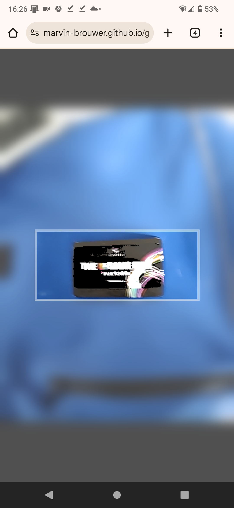
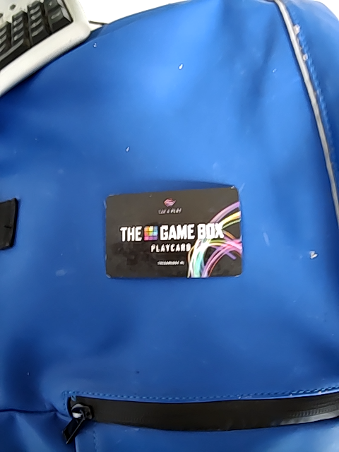

# Guessify Scanners

We tried using off the shelf barcode scanners. However, no dice.
We got [`barcode-detector`](https://github.com/Sec-ant/barcode-detector/) to work, but, this one doesn't support custom scanners.
We tried [`@ericblade/quagga2`](https://github.com/ericblade/quagga2), but, this required too much setup outside what we already had.
Thus, we decided to roll our own scanner.

We found [this article](https://boonepeter.github.io/posts/spotify-codes-part-2/) explaining how the Spotify codes work.
Since we we're planning to use the article and [it's repo](https://github.com/boonepeter/boonepeter.github.io-code/tree/main/spotify-codes-part-2) to build our own scanner for `quagga`, we can use it for our own crude scanner too.

## Finding the code

Normally, barcode scanners that use video support all kinds of orientations.  
We're planning on scanning inside of a rectangular lens, so only close to horizontal will be supported by our app, making it quite a bit simpler to find it.

### Sampling corners

We'll need to find where the code is, but before we start scanning every frame for a Spotify code or trying to detect whether there even is a rectangle.
We did some digging into edge detection, but, most examples are either detecting all edges in the image, or written in Python using python libraries for the heavy lifting.

Our approach is going to be simple, we're going to start sampling from the corners, divide into squares.  
We can safely do this because we oversample black and white and ignore other colors.  

For example, when scanning a random black card, the app shows this when dev mode is on:  
  
For reference, the video feed coming in looks like this:  
  
And the processed image looks like this (mind the transparency):  
  

The process of checking corners will be a recursive edge-detection,  
loosely based on this approach <https://github.com/jankovicsandras/imagetracerjs/blob/master/process_overview.md>:  
  
  

As illustrated in `checking-the-corner.drawio`, for the right-top corner, we will start by sampling a square of about a third of the lens's height.
The sample will be divided into 4 sections. 
This sample needs to have black in the left bottom section, and none in the others (not accounting for noise).
If true, we'll take the left-bottom, then the right-top, section and repeat recursively until failure.  

Now we roughly know where the corner is with increasing resolution.  

If we don't get a valid result from 4 corners, we bail out of the check and ignore the scan.
If we have 4 corners, we have a square in the viewfinder, and, we move on to the next step.

### Tracing a prism

`TODO`

Possible resources: 

- <https://stackoverflow.com/questions/70934872/get-the-points-for-the-corners-of-a-rectangle>  
  Has a nice example of drawing a shape
- <https://stackoverflow.com/questions/60062044/finding-the-corners-of-a-rectangle>

### Permutate

`TODO`

We'll need to find the middle line if it's not perfectly rectangular in the viewfinder.  

### Scan the code!

`TODO`  

- <https://boonepeter.github.io/posts/2020-11-10-spotify-codes/>
- <https://boonepeter.github.io/posts/spotify-codes-part-2/>
- <https://github.com/boonepeter/boonepeter.github.io-code/tree/main/spotify-codes-part-2>
- <https://en.wikipedia.org/wiki/Intelligent_Mail_barcode>
- <https://github.com/Sec-ant/zxing-wasm#notes>
